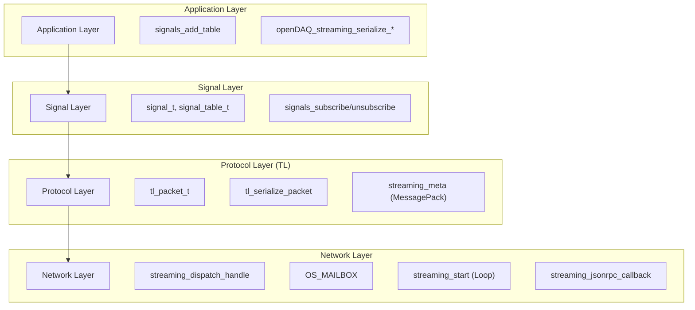

# openDAQ Streaming Data Flow

This document describes the data flow within the `openDAQ_LT` streaming implementation, from the network level to the application level.

## Architectural Layers

The implementation follows a layered architecture, as shown in the diagram below:



---

## 1. Connection Lifecycle

1.  **Incoming Connection:** When a client initiates a WebSocket connection (typically on `/streaming`), the `emWeb` hook `streaming_dispatch_handle` (in `streaming_handler.c`) is triggered.
2.  **Handover:** The connection handle (socket) is placed into an `OS_MAILBOX`.
3.  **Task Activation:** The `streaming_start` task (main server loop) waits for a handle from the mailbox.
4.  **Stream Initialization:**
    - A `stream` object is allocated and assigned a unique `stream_id`.
    - `streaming_send_meta_stream` sends the "stream init" metadata (MessagePack) over the Data Channel.
    - `signals_send_all_avail` sends the "available signals" metadata.

---

## 2. Control Channel Flow (Subscription)

The Control Channel is asynchronous to the Data Channel and uses JSON-RPC over HTTP.

1.  **JSON-RPC Request:** The client sends a POST request with a method like `8A2B3C4D.subscribe` (where `8A2B3C4D` is the `streamId`).
2.  **Dispatch:** `streaming_jsonrpc_callback` parses the JSON using `mjson`.
3.  **Signal Subscription:** `rpc_cb_subscribe` calls `signals_subscribe` (in `streaming_signals.c`).
4.  **Metadata Trigger:** `signals_subscribe` marks the signal as subscribed and immediately triggers `streaming_send_meta_signal`.
5.  **Data Channel Response:** A `TYPE_META` TL packet containing the signal's full definition (rules, data types) is sent to the client via the Data Channel.

---

## 3. Data Channel Flow (Transmission)

The Data Channel is unidirectional from Server to Client.

1.  **App Serialization:** The application calls one of the serialization functions in `streaming_packet.c` (e.g., `openDAQ_streaming_serialize_explicit_signal`).
2.  **Packet Construction:**
    - A `tl_packet_t` is initialized with the signal number and payload.
    - `tl_serialize_packet` constructs the header (4-12 bytes) and serializes the payload.
3.  **Encapsulation:**
    - **TL Header:** Contains the signal number, packet type (Data/Meta), and payload size.
    - **WebSocket Header:** If enabled, the TL packet is wrapped in a binary WebSocket frame.
4.  **Network Send:** The finalized buffer is sent through the socket using `stream->stream` (wraps `send()`) or `stream->streamp` (zero-copy).

---

## 4. Signal Rules & Serialization

Different signal rules determine how data is packed into the TL payload:

| Rule | Serialization Logic | Payload Structure |
| :--- | :--- | :--- |
| **Explicit** | All samples are copied and converted to little-endian. | `[Sample 0][Sample 1]...[Sample N]` |
| **Constant** | Only changes are transmitted. | `[uint64_t Index][Sample Value]` |
| **Linear** | Accumulator resets/sync points are transmitted. | `[uint64_t Index][Sample Value]` |
| **Implicit** | Only the index is transmitted (data is inferred). | `[uint64_t Index][Sample Value]` |

*Note: In `openDAQ_LT`, Constant, Linear, and Implicit rules use the same `openDAQ_streaming_serialize_implicit_signal` helper, which packs a `uint64_t` index followed by a single sample.*

---

## 5. Packet Encapsulation Diagram

```text
+-----------------------------------------------------------+
| WebSocket Header (2-4 bytes) [Optional]                   |
+-----------------------------------------------------------+
| TL Header (4 or 8 bytes)                                  |
| - Type (Data/Meta)                                        |
| - Signal Number                                           |
| - Payload Size                                            |
+-----------------------------------------------------------+
| TL Payload (Variable)                                     |
|                                                           |
| If TYPE_META:                                             |
|   +---------------------------------------+               |
|   | Meta Type (4 bytes: MessagePack = 2)  |               |
|   +---------------------------------------+               |
|   | MessagePack Data (mpack)              |               |
|   +---------------------------------------+               |
|                                                           |
| If TYPE_DATA:                                             |
|   +---------------------------------------+               |
|   | [Optional uint64_t Index]             |               |
|   +---------------------------------------+               |
|   | Sample Data (Little-Endian)           |               |
|   +---------------------------------------+               |
+-----------------------------------------------------------+
```
